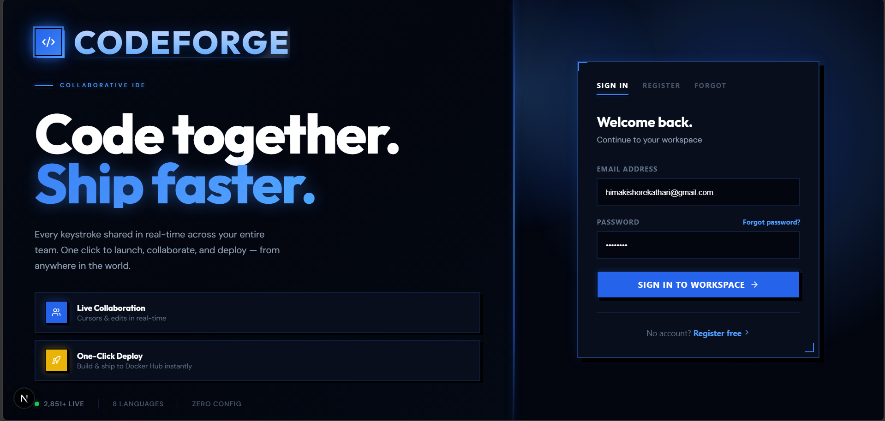
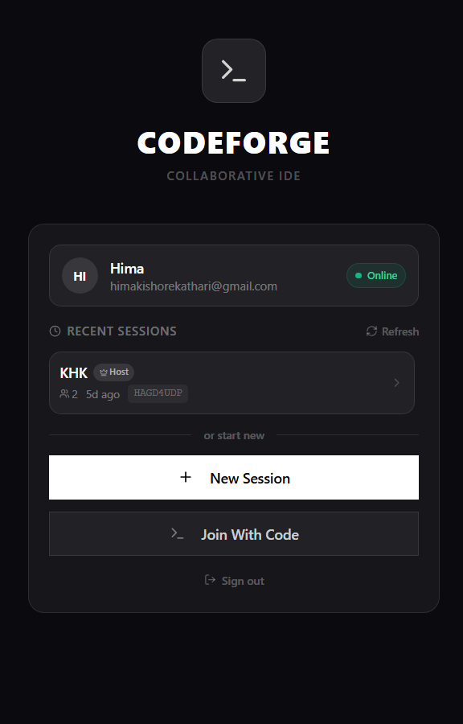
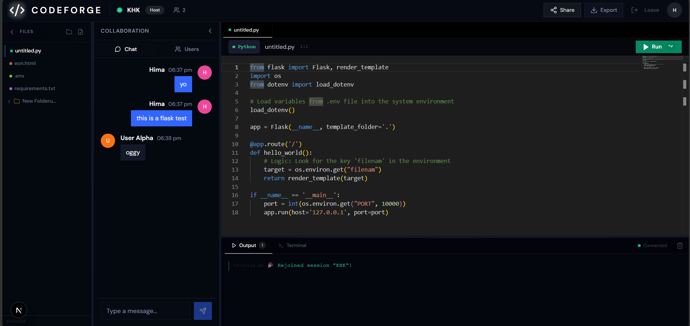
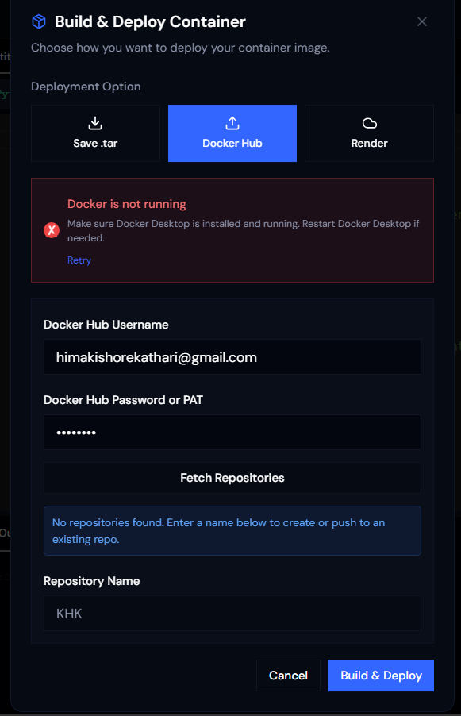
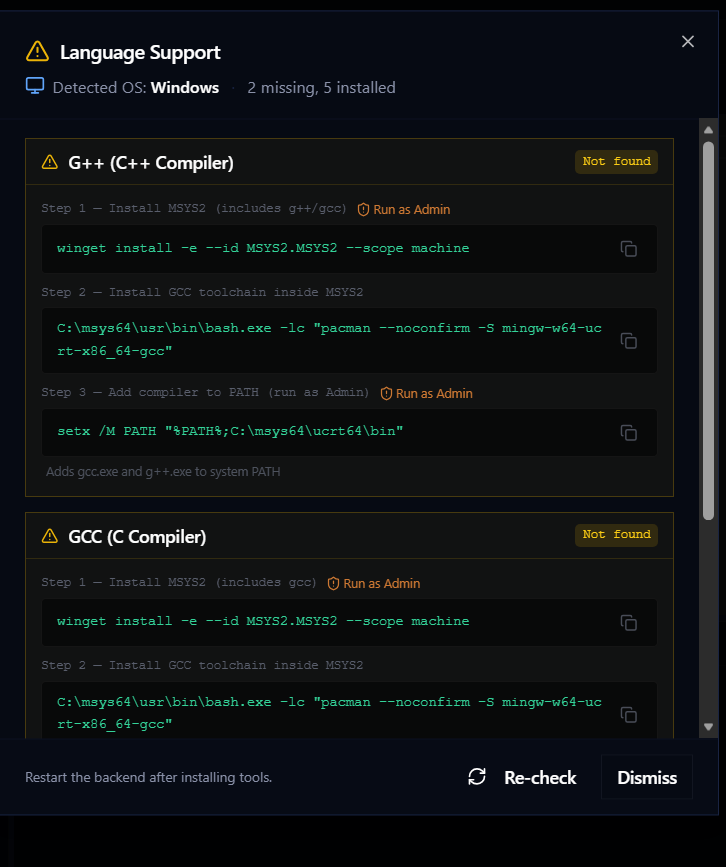

<div align="center">



#  **CODEFORGE**

### Real-Time Collaborative IDE • Zero Setup • Instant Deployment

[](https://reactjs.org/)
[](https://nextjs.org/)
[](https://www.typescriptlang.org/)
[](https://nodejs.org/)

</div>

<br/>

## 💡 What is CodeForge?

**CodeForge** is a browser-based collaborative IDE that eliminates setup barriers. Code together in real-time, execute in 8+ languages, and deploy to Docker — all from your browser.

### ⚡ Core Features

```
🔄  Real-time Collaboration       💾  Session Persistence
🚀  Multi-language Execution       🐳  Instant Docker Deployment  
💬  Live Chat Integration          📁  Full File Management
🔐  Firebase Authentication        ⚙️  Zero Configuration
```

<br/>

## 🎨 Interface

### Session Management

<div align="center">

</div>

<br/>

<div align="center">

| 🆕 Create | 🔗 Join | ♻️ Rejoin |
|-----------|---------|-----------|
| Start a new session with one click | Enter session code (ABC123XYZ) | Auto-restore your last session |

</div>

<br/>

### The IDE Workspace

<div align="center">

</div>

<br/>

<table>
<tr>
<td width="25%">

**📂 File Explorer**
- Create files/folders
- Rename & delete
- Language indicators
- File locking

</td>
<td width="25%">

**✏️ Code Editor**
- Monaco Editor (VS Code)
- Syntax highlighting
- Auto-completion
- Real-time sync

</td>
<td width="25%">

**🖥️ Output Panel**
- Streaming execution
- Interactive stdin
- Terminal access
- Process control

</td>
<td width="25%">

**👥 Collaboration**
- Live chat
- User presence
- Role management
- Activity feed

</td>
</tr>
</table>

<br/>

## 🐳 Export & Deployment

<div align="center">

</div>

<br/>

<div align="center">

**One-Click Containerization**

| 📦 Download | 🐳 Docker Hub | ☁️ Render |
|-------------|---------------|-----------|
| Export as ZIP archive | Push to your repository | Deploy to cloud instantly |

</div>

<br/>

## 🌐 Language Support

<div align="center">

</div>

<br/>

### 8 Languages, Unlimited Possibilities

<table>
<tr>
<td width="50%">

**🌍 Web Technologies**
```html
<div class="awesome">
  <h1>Build web apps instantly</h1>
</div>
```

**🐍 Python**
```python
import pandas as pd
df = pd.read_csv("data.csv")
```

**☕ Java**
```java
public class Main {
    public static void main(String[] args) {
        System.out.println("CodeForge!");
    }
}
```

</td>
<td width="50%">

**⚡ TypeScript**
```typescript
interface Project {
  name: string;
  files: File[];
}
```

**🔧 C/C++**
```cpp
#include <iostream>
int main() {
    std::cout << "Low-level power!";
    return 0;
}
```

**✨ Auto-Detection**
- File extension recognition
- Syntax highlighting
- Runtime selection
- Dependency management

</td>
</tr>
</table>

<br/>

## 🚀 Quick Start

```bash
# 1. Clone the repository
git clone https://github.com/yourusername/codeforge.git
cd codeforge

# 2. Install dependencies
cd frontend && npm install
cd ../backend && npm install

# 3. Configure Firebase
# Add your credentials to frontend/.env.local
# Add firebase-service-account.json to backend/

# 4. Start the servers
cd backend && npm start        # Backend on :5001
cd frontend && npm run dev     # Frontend on :9002

# 5. Open browser
http://localhost:9002
```

### Requirements

| Frontend | Backend | Optional |
|----------|---------|----------|
| Node.js 18+ | Node.js 18+ | Docker |
| npm 9+ | Python 3.x | Git |
| | Java JDK 11+ | |
| | GCC/G++ | |

<br/>

## 🎯 How to Use

<div align="center">

| Step 1 | Step 2 | Step 3 | Step 4 | Step 5 |
|--------|--------|--------|--------|--------|
| **Sign Up** | **Create Session** | **Code Together** | **Execute Code** | **Deploy** |
| Create account | Start workspace | Real-time editing | Run in 8+ languages | Export/Deploy |

</div>

<br/>

## ⚡ Key Features

### Real-Time Collaboration

<table>
<tr>
<td width="50%">

**What You Get:**
- 🔄 **Instant Sync** - Changes in <100ms
- 💬 **Integrated Chat** - Discuss without leaving IDE
- 👥 **Presence System** - See who's online
- 🎨 **User Colors** - Unique identifiers
- 🔐 **Role Management** - Host, Co-host, Editor, Viewer

</td>
<td width="50%">

**Technical:**
```javascript
socket.on('file_update', (data) => {
  updateEditorContent(data.fileId, data.content);
});

socket.on('chat_message', (msg) => {
  appendMessage(msg);
});
```

</td>
</tr>
</table>

### Session Persistence

<table>
<tr>
<td width="33%">

**What Persists:**
- All files and code
- Chat history
- Participants
- Session settings
- File structure

</td>
<td width="33%">

**How It Works:**
1. Edit file → 150ms debounce
2. Auto-save to Firestore
3. Hard refresh → Auto-restore
4. Zero data loss

</td>
<td width="33%">

**Security:**
- Firebase Auth
- Access control
- Encrypted WebSocket
- Role-based permissions

</td>
</tr>
</table>

### Code Execution Engine

| Feature | Status |
|---------|--------|
| ✅ Streaming Output | Real-time stdout/stderr |
| ✅ Interactive stdin | User input during execution |
| ✅ Multi-language | 8+ language support |
| ✅ Process Control | Kill running processes |
| ✅ Error Handling | Colored error messages |
| ✅ Timeout Protection | No hanging processes |
| ✅ File Context | Access all project files |
| ✅ Auto Java Detection | Smart class name parsing |

<br/>

## 🛠️ Development

### Project Structure

```
codeforge/
├── frontend/               # Next.js 15 application
│   ├── src/
│   │   ├── app/           # App Router pages
│   │   ├── components/    # React components
│   │   │   ├── auth/     # Authentication UI
│   │   │   ├── ide/      # IDE interface
│   │   │   ├── session/  # Session management
│   │   │   └── ui/       # Reusable components
│   │   ├── contexts/     # React Context providers
│   │   └── lib/          # Utilities
│   └── package.json
│
├── backend/               # Node.js + Express server
│   ├── index.js          # Main server (~1900 lines)
│   └── package.json
│
└── readme-img/           # Documentation images
```

### Tech Stack

<table>
<tr>
<td width="50%">

**Frontend**
```json
{
  "next": "15.5.9",
  "react": "19.2.1",
  "typescript": "5.x",
  "@monaco-editor/react": "4.7.0",
  "socket.io-client": "4.7.5",
  "firebase": "11.9.1",
  "tailwindcss": "3.4.1"
}
```

</td>
<td width="50%">

**Backend**
```json
{
  "express": "4.21.0",
  "socket.io": "4.7.5",
  "firebase-admin": "12.5.0",
  "archiver": "7.0.1",
  "uuid": "latest",
  "cors": "latest"
}
```

</td>
</tr>
</table>

<br/>

## 🧪 Testing & Quality

### Verified Features

| Category | Features | Status |
|----------|----------|--------|
| 🔐 Authentication | Email/password, verification, reset | ✅ Tested |
| 💾 Persistence | Auto-save, restore on refresh | ✅ Tested |
| 🔄 Real-time | File sync, chat, presence | ✅ Tested |
| 🚀 Execution | Python, JS, Java, C++, etc. | ✅ Tested |
| 🐳 Deployment | Docker build, Hub push | ✅ Tested |
| 📁 File System | CRUD operations, folders | ✅ Tested |
| 👥 Collaboration | Multi-user, roles, presence | ✅ Tested |
| 🔌 Socket.IO | Reconnection, error handling | ✅ Tested |

<br/>

## 📊 Performance

<div align="center">

| ⚡ Fast | 🎯 Efficient | 📦 Lightweight | 🔋 Scalable |
|---------|--------------|----------------|-------------|
| <100ms latency | 150ms debounce | Optimized bundle | Socket.IO rooms |

</div>

**Optimization Techniques:**
- ✅ Debounced Firestore writes (150ms)
- ✅ Lazy loading components
- ✅ WebSocket connection pooling
- ✅ Code splitting (Next.js automatic)
- ✅ Image optimization

<br/>

## 🤝 Contributing

We welcome contributions!

<table>
<tr>
<td width="33%">

**🐛 Report Bugs**
1. Check existing issues
2. Create detailed report
3. Include screenshots
4. Steps to reproduce

</td>
<td width="33%">

**✨ Suggest Features**
1. Open feature request
2. Describe use case
3. Explain benefits
4. Discuss implementation

</td>
<td width="33%">

**💻 Submit Code**
1. Fork repository
2. Create feature branch
3. Make changes
4. Submit pull request

</td>
</tr>
</table>

**Development Workflow:**
```bash
git clone https://github.com/your-username/codeforge.git
git checkout -b feature/amazing-feature
git commit -m "Add amazing feature"
git push origin feature/amazing-feature
# Open Pull Request
```

<br/>

## 📜 License

This project is licensed under the **MIT License**.

```
MIT License - Copyright (c) 2026 CodeForge
Permission is hereby granted, free of charge, to any person obtaining a copy...
```

<br/>

## 🙏 Acknowledgments

<div align="center">

**Powered By**

[](https://nextjs.org/)
[](https://reactjs.org/)
[](https://www.typescriptlang.org/)
[](https://firebase.google.com/)
[](https://socket.io/)
[](https://tailwindcss.com/)
[](https://www.docker.com/)
[](https://microsoft.github.io/monaco-editor/)

</div>

<br/>

<div align="center">

## ⭐ Show Your Support

**Give a ⭐️ if this project helped you!**


---

**[⬆ Back to Top](#-codeforge)**

</div>
